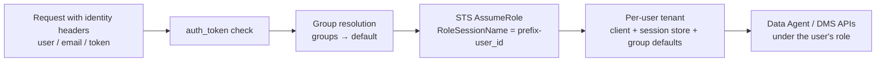

# Alibaba Cloud Data Agent MCP Skill

A standalone Agent Skill that exposes **Alibaba Cloud Apsara Data Agent for Analytics** as a native MCP server (`data-agent`, 18 `data_agent_*` tools), built in Go. AI assistants call the tools directly to discover databases, run natural language analysis, track progress via server-side SSE monitoring, and fetch conclusions, charts, and file artifacts (reports / Excel exports).

> Looking for the Python CLI integration instead? See the repository root [README](../README.md) and [SKILL.md](../SKILL.md).

## Requirements

- **Go 1.23+** (https://go.dev/dl/) — binaries are not committed; the launcher builds from source on first run and caches it under `assets/server/bin/` (gitignored)
- Alibaba Cloud credentials with `AliyunDMSFullAccess` or `AliyunDMSDataAgentFullAccess` (see [references/ram-policies.md](references/ram-policies.md))
- Data sources managed in Alibaba Cloud DMS / Data Agent Data Center

## Configuration

Sources and priority (highest wins): **env vars > `.env` file > `config.yaml` > defaults**.

```bash
cd assets/server
cp .env.example .env               # secrets: AK/SK (never commit; gitignored)
cp config.yaml.example config.yaml # non-secret settings (gitignored)
```

### config.yaml (full reference)

Lookup order: `$DATA_AGENT_CONFIG` > `./config.yaml` > `~/.data-agent/config.yaml` > legacy `~/.data-agent/config.json` (JSON still parsed).

| Key | Default | Description |
|-----|---------|-------------|
| `region` | `cn-hangzhou` | DMS region ID |
| `dms_unit` | auto-resolved | DMSUnit override (skips `GetActiveRouteUnit` lookup) |
| `workspace_id` | auto personal workspace | Default Data Agent workspace |
| `sessions_dir` | `~/.data-agent/sessions` | Local session state directory |
| `api_key` | — | API Key auth (alternative to AK/SK; **incompatible with identity mode**) |
| `dms_enterprise_endpoint` | `dms-enterprise.{region}.aliyuncs.com` | Host for the dms-enterprise metadata APIs (database/table/instance discovery, import tagging, `GetActiveRouteUnit`); set a VPC endpoint when public egress is unavailable. Not covered by any Data Agent endpoint setting |
| `data_agent_endpoint` | `dms.{region}.aliyuncs.com` | Host for the AK/SK-signed Data Agent API (session create/send/status and the SSE stream) |
| `api_key_endpoint` | `dataagent-{region}.aliyuncs.com` | API Key control-plane host (ignored with AK/SK auth) |
| `api_key_stream_endpoint` | `dataagent-stream-{region}.aliyuncs.com` | API Key streaming-plane host (ignored with AK/SK auth) |
| `upload.allowed_dirs` | `[]` (empty) | Directories `data_agent_upload_file` may read. HTTP transports refuse every upload while empty (fail-closed); stdio stays unrestricted until the list is set |
| `log.requests` | `basic` on HTTP transports, `off` on stdio | Per-tool-call logging: `basic` (tool, caller, outcome, duration) \| `full` (adds redacted arguments) \| `off`. A standalone deployment logs by default; stdio stays quiet because the host agent owns the console. The identity token is never logged |
| `sts.endpoint` | `sts.{region}.aliyuncs.com` | STS endpoint used for AssumeRole |
| `sts.session_expiration` | `3600` | Temporary credential lifetime in seconds |
| `identity.enabled` | `false` | Turn on multi-tenant identity mapping (HTTP/SSE transports only; legacy section name `aily` still accepted) |
| `identity.require_identity` | `false` | Reject requests without identity headers instead of using the server identity |
| `identity.auth_token` | — | Caller authentication token; must equal the token header on every request (legacy name `shared_secret` still accepted) |
| `identity.session_name_prefix` | `aily` | STS RoleSessionName = `<prefix>-<user_id>` |
| `identity.headers.user/email/token` | `x-aily-user` / `x-aily-email` / `x-aily-token` | Identity header names (rename for non-Aily upstreams) |
| `identity.default` | — | **Style 1 — global sharing**: one role (+ optional `workspace_id` / `custom_agent_id` / `mode` defaults) for every identified user |
| `identity.groups.<name>` | — | **Style 2 — groups**: per-group `role_arn` + session defaults + `users` list (user id or email; one group per user; wins over default) |

### .env / environment variables

The `.env` file (path: `$DATA_AGENT_ENV_FILE`, else `./.env`) is loaded into the process environment at startup without overriding already-set variables — so every row below works from either place.

| Variable | Purpose |
|----------|---------|
| `ALIBABA_CLOUD_ACCESS_KEY_ID` / `ALIBABA_CLOUD_ACCESS_KEY_SECRET` | Long-term AK/SK. Falls back to the default credential chain (`~/.aliyun/config.json`, ECS instance role) when unset |
| `ALIBABA_CLOUD_SECURITY_TOKEN` | STS token, read together with the AK/SK pair when running on temporary credentials |
| `DATA_AGENT_REGION` / `BUDDY_REGION` | Region override (`DATA_AGENT_REGION` wins) |
| `DATA_AGENT_DMS_UNIT` / `DATA_AGENT_WORKSPACE_ID` / `DATA_AGENT_SESSIONS_DIR` / `DATA_AGENT_API_KEY` | Override the matching config keys |
| `DATA_AGENT_DMS_ENTERPRISE_ENDPOINT` | dms-enterprise host for the metadata APIs; overrides `dms_enterprise_endpoint`. Default `dms-enterprise.{region}.aliyuncs.com` — set for VPC-only egress or non-public-cloud |
| `DATA_AGENT_ENDPOINT` | Host of the AK/SK-signed Data Agent API (sessions + SSE); overrides `data_agent_endpoint`. Default `dms.{region}.aliyuncs.com` |
| `DATA_AGENT_API_KEY_ENDPOINT` / `DATA_AGENT_API_KEY_STREAM_ENDPOINT` | API Key control/streaming hosts; override `api_key_endpoint` / `api_key_stream_endpoint` |
| `DATA_AGENT_CONFIG` / `DATA_AGENT_ENV_FILE` | Explicit config / .env file paths |
| `AILY_SHARED_SECRET` / `IDENTITY_SHARED_SECRET` / `IDENTITY_AUTH_TOKEN` | Overrides `identity.auth_token` |
| `MCP_TRANSPORT` / `MCP_PORT` | `stdio` (default) \| `streamable-http` \| `sse`; port is required for HTTP transports |
| `DATA_AGENT_UPLOAD_DIRS` | Path list (`:`-separated) confining `data_agent_upload_file`; overrides `upload.allowed_dirs`. Required on HTTP transports, which otherwise refuse uploads |
| `DATA_AGENT_LOG_REQUESTS` | `basic` \| `full` \| `off`; overrides `log.requests`. Unset = `basic` on HTTP transports, `off` on stdio |
| `DATA_AGENT_DEBUG_SSE` | `1` = log raw SSE traffic (debugging) |

## Identity & RAM Role Assumption (how 角色扮演 works)

With `identity.enabled: true`, the server never serves data under its own identity for user requests. The upstream caller (Feishu Aily by default — any gateway/portal forwarding identity headers works) sends the end-user identity on every request, and each call executes under a RAM role assumed **on behalf of that user**:



### Identity headers & caller authentication

The server does no login of its own — it trusts the upstream platform to say **who the end user is**, and verifies that the request **really comes from that platform**. Two config knobs cover this:

**`identity.headers` — where the identity comes from.** On every MCP request the upstream attaches three HTTP headers, and this setting names them:

| Key | Default (Feishu Aily convention) | Carries |
|-----|----------------------------------|---------|
| `headers.user` | `x-aily-user` | End-user id — drives group matching, `RoleSessionName`, and the per-user session directory |
| `headers.email` | `x-aily-email` | End-user email — secondary key for group matching |
| `headers.token` | `x-aily-token` | Caller authentication token (compared against `auth_token`) |

For Feishu Aily nothing needs to be configured — the defaults match. To integrate another upstream (an internal gateway sending `x-gateway-uid`, a portal, a bot platform), just rename the headers here; no code changes are needed.

**`identity.auth_token` — why the identity can be trusted.** Identity headers are plain HTTP headers: anyone who can reach the endpoint could forge `x-aily-user: <someone else>`. When `auth_token` is set, the token header must match it **before any group resolution happens**, so only the upstream platform that knows the token can act on behalf of users. Set the same value as a custom header in the upstream MCP registration (env override: `IDENTITY_AUTH_TOKEN`; legacy `shared_secret` yaml key and `AILY_SHARED_SECRET` env still work).

1. **Identity intake** — the upstream adds the user id / email headers (names configurable via `identity.headers`; defaults `x-aily-user` / `x-aily-email`); the server copies them into the request context. stdio transport has no headers, so identity mode applies to HTTP/SSE only.
2. **Legitimacy check** — if `auth_token` is set, the token header must match, otherwise the request is rejected before any group resolution.
3. **Group resolution (first match wins)** — membership in a named `identity.groups.<name>` (matched by user id or email) → `identity.default` (catch-all) → **reject** (fail-closed; never silently falls back to the server identity). Missing identity headers are rejected too when `require_identity: true`.
4. **AssumeRole** — the base AK/SK calls STS AssumeRole on the group's role with `RoleSessionName = <session_name_prefix>-<user_id>` (default prefix `aily`; sanitized, ≤64 chars). Temporary credentials are cached and **auto-refreshed before expiry** (credentials-go `ram_role_arn` provider); long-running SSE watchers pick up rotated tokens transparently.
5. **Per-user tenant isolation** — every identified user gets a dedicated API client and session store at `sessions_dir/identity/<user>/`, even when many users share one role (default group). Session listing/status/results never leak across users. The group's `workspace_id` / `custom_agent_id` / `mode` become session defaults when `data_agent_create_session` omits them.
6. **Authorization & audit** — what a user can query is decided entirely by the RAM policies and DMS data permissions attached to the group's role; the MCP server does no data-level authorization itself. In ActionTrail every call shows as `assumed-role/<role>/<prefix>-<user_id>`, so per-user attribution survives shared roles.

RAM prerequisites:

- Each group role trusts the base account and carries `AliyunDMSDataAgentFullAccess` (or a narrower DMS policy) plus the intended DMS data permissions
- The base AK/SK RAM user needs `sts:AssumeRole` on **every** group/default role
- `api_key` auth cannot be combined with identity mode (DMS Enterprise + STS require AK/SK)

## Deployment

### Option 1: stdio (client launches the binary)

For clients that spawn tool processes locally (Claude Code, Qoder, Codex, etc.):

```json
{
  "mcpServers": {
    "data-agent": {
      "command": "bash",
      "args": ["/absolute/path/to/alibabacloud-data-agent-mcp-skill/scripts/select-binary.sh"],
      "env": {
        "DATA_AGENT_WORKSPACE_ID": "your-workspace-id",
        "DATA_AGENT_DMS_UNIT": "cn-hangzhou"
      }
    }
  }
}
```

Where to put it:

- **Claude Code**: `~/.claude/settings.json` (or project `.claude/settings.json`), then restart / run `/mcp`
- **Qoder**: `~/.qoder/mcp.json`

`select-binary.sh` picks the platform binary, or builds it with Go on first launch.

### Option 2: Streamable HTTP (standalone long-running service)

Best for shared/hosted deployments — one process, any MCP client connects over a URL. `MCP_PORT` must be set explicitly:

```bash
MCP_TRANSPORT=streamable-http MCP_PORT=8931 \
  bash scripts/select-binary.sh
```

Register in the client (endpoint path `/mcp`):

```json
{
  "mcpServers": {
    "data-agent": { "url": "http://<host>:8931/mcp" }
  }
}
```

For SSE-only clients, start with `MCP_TRANSPORT=sse` and connect to `http://<host>:8931/sse`.

For production, run it under a supervisor (systemd / launchd / container). Example systemd unit:

```ini
[Service]
WorkingDirectory=/opt/alibabacloud-data-agent-mcp-skill/assets/server
Environment=MCP_TRANSPORT=streamable-http MCP_PORT=8931
ExecStart=/usr/bin/bash /opt/alibabacloud-data-agent-mcp-skill/scripts/select-binary.sh
Restart=always
```

### Option 3: Multi-tenant deployment (e.g. Feishu Aily)

Enable the `identity` section in `config.yaml` (mechanism: see [Identity & RAM Role Assumption](#identity--ram-role-assumption-how-角色扮演-works) above):

```yaml
identity:
  enabled: true
  require_identity: true            # fail-closed: reject requests without identity headers
  auth_token: "<random-token>"      # must match the token header set in the upstream registration
  default:                          # style 1: global sharing (catch-all)
    role_arn: acs:ram::<account-id>:role/da-default
    mode: lite
  groups:                           # style 2: per-group role + session defaults
    analysts:
      role_arn: acs:ram::<account-id>:role/da-analysts
      workspace_id: ws-analysts
      mode: pro
      users: [ou_alice, bob@example.com]
```

Deploy as Option 2 (Streamable HTTP) where the upstream egress can reach it, and register the URL plus the custom token header (default `x-aily-token`) in the upstream MCP tool settings. For Feishu Aily no header renaming is needed — the defaults match the `x-aily-*` convention.

> **Security**: identity headers are spoofable by anyone who can reach the endpoint. Keep it off the public internet (private network / gateway allowlist) and always set `auth_token`.

## Verify the Deployment

```bash
# stdio handshake
printf '{"jsonrpc":"2.0","id":1,"method":"initialize","params":{"protocolVersion":"2024-11-05","capabilities":{},"clientInfo":{"name":"smoke","version":"0"}}}\n' \
  | bash scripts/select-binary.sh
# → serverInfo "data-agent-mcp-server"; the client should list 18 data_agent_* tools
```

### dacli — manual verification client

`cmd/dacli` is a bundled CLI that calls the HTTP endpoint exactly like Aily does (identity headers on every request). Ideal for verifying an Option 2/3 deployment by hand:

```bash
cd assets/server && make dacli   # -> bin/dacli (or: go build -o bin/dacli ./cmd/dacli)

# identity via flags (or env: AILY_MCP_URL / AILY_USER / AILY_EMAIL / AILY_TOKEN)
./bin/dacli --url http://localhost:8931/mcp \
  --user ou_xxxxxxxx --token <shared-secret> <command>

# commands
./bin/dacli ... tools                     # list the 18 MCP tools
./bin/dacli ... workspaces                # visible workspaces under the assumed role
./bin/dacli ... dbs                       # workspace Data Center databases
./bin/dacli ... ask chinook "album,artist,track" "哪个艺术家的专辑数量最多？"
#   ^ golden path in one command: resolve db → create lite session → wait → conclusions
./bin/dacli ... send <session_id> "那最低的呢？"  # follow-up on an existing (even finished) session
./bin/dacli ... status|wait|result|files <session_id> ...
./bin/dacli ... call <tool> '<json-args>' # raw tool call
./bin/dacli ... repl                      # interactive loop
```

A wrong `--token` or a user matching no group (without `identity.default`) must be rejected (fail-closed) — that is the multi-tenant access control working as intended. Chart images returned by `result` are saved to `./dacli-out/`.

Then from the AI client: `data_agent_list_workspaces` → `data_agent_list_workspace_databases` should return real data. Full tool reference, workflows, and troubleshooting: [SKILL.md](SKILL.md).

## Build & Development

All builds run from `assets/server/` and output to `assets/server/bin/` (gitignored — binaries are never committed). Go 1.23+ required.

```bash
cd assets/server

# MCP server — normally you don't build it by hand:
#   scripts/select-binary.sh builds it automatically on first launch.
make build            # -> bin/data-agent-mcp-server (current platform)
make build-all        # -> bin/data-agent-mcp-server-linux-{amd64,arm64} (cross-compile)

# dacli — manual verification client
make dacli            # -> bin/dacli

# equivalents without make
go build -trimpath -ldflags "-s -w" -o bin/data-agent-mcp-server .
go build -trimpath -ldflags "-s -w" -o bin/dacli ./cmd/dacli

# tests & debugging
make test             # go test ./... (config / tenant / mcp / session / dataagent / event)
DATA_AGENT_DEBUG_SSE=1 ...   # log raw SSE traffic when debugging event parsing
```

## Layout

```
├── SKILL.md                     # Agent instructions (tools, workflows, troubleshooting)
├── README.md                    # This file — human deployment guide
├── scripts/select-binary.sh     # Launcher: pick platform binary or build from source
├── references/
│   ├── INSTALLATION.md          # Setup reference (transports, credentials, config, identity mode)
│   └── ram-policies.md          # RAM permission requirements
└── assets/server/               # Go MCP Server source
    ├── config.yaml.example      # Config template
    ├── .env.example             # Secrets template
    ├── cmd/dacli/               # Manual verification client (Aily-style HTTP calls)
    └── internal/                # config / dataagent / mcp / session / tenant / event
```

## License

Apache License 2.0 — see [../assets/LICENSE](../assets/LICENSE).
